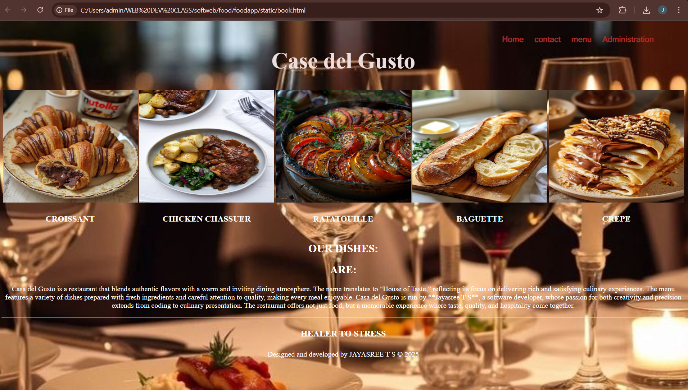
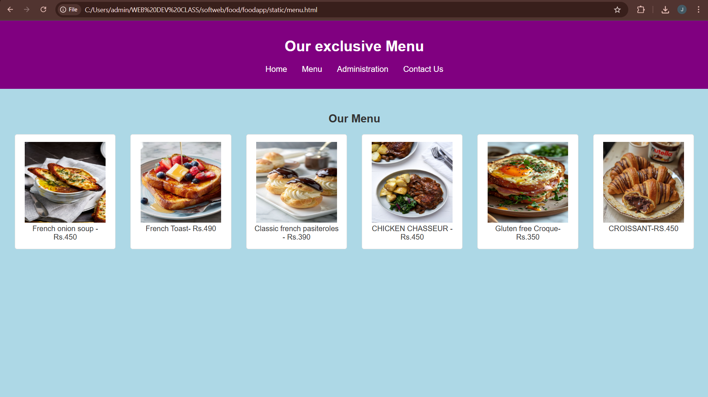
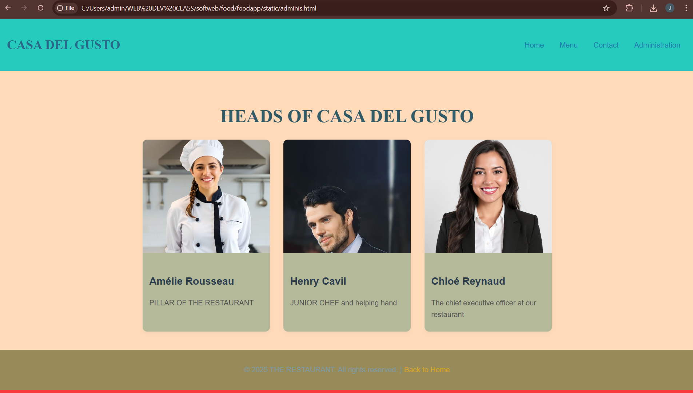
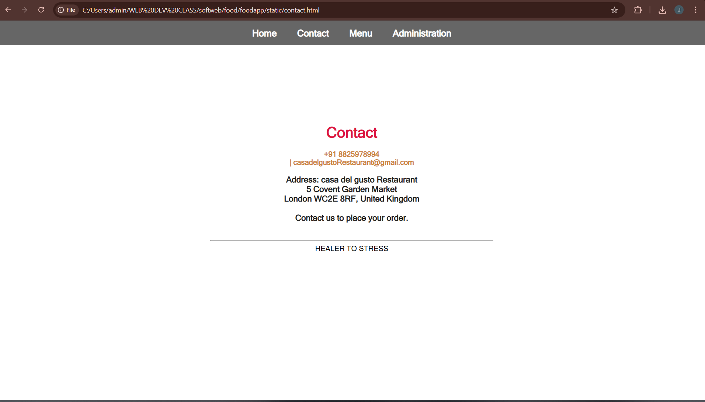

# Ex.07 Restuarant Website
## Date:

## AIM:
To develop a static Resturant website to display the menu and services provided by the resturant.

## DESIGN STEPS:

### Step 1:
Requirement collection.

### Step 2:
Creating the layout using HTML and CSS.

### Step 3:
Updating the sample content.

### Step 4:
Choose the appropriate style and color scheme.

### Step 5:
Validate the layout in various browsers.

### Step 6:
Validate the HTML code.

### Step 7:
Publish the website in the given URL.

## PROGRAM:
book.html
```
<!DOCTYPE html>
<html lang="en"?>
    <head>
        <title style="color:black;">Case del Gusto</title>
        
    </head>
    <br>
    
    <style>
        body{
            background-image: url("cup.jpg");
            background-size: cover;
            background-position: center;
        }
        .nav-list{
            position: absolute;
            top: 30px;
            left: 70%;
            transform:  translatex(10%);
        }
        .nav-list a{
            display: inline blocks;
            margin: 0 10px;
            font-family:MS Sans Serif;
            text-decoration: none;
            font-size: 18px;
            font-weight: bold;
            color: brown;
        }
        .nav-list a:hover{
            color: rgb(235, 9, 149);
        }
    </style>
        <div class="nav-list">
        
        <a href="rest.html">Home</a>
        <a href="contact.html">contact</a>
        <a href="menu.html">menu</a>
        <a href="adminis.html">Administration</a>

        </div>
    <body style="color:white;">
        
        <center>
            <h1 style="color:rgb(236, 222, 222); font-size: 50px;">Case del Gusto</h1>
    <table> 
        <center>
        <tr>
            <td></td>
            <td></td>
            <td></td>
            <td></td>
            <td></td>
        </tr>
        </center>
        <tr>
            <td><h3 style="color:white;"><center>CROISSANT</center></h3></td>
            <td><h3 style="color:white;"><center>CHICKEN CHASSUER</center></h3></td>
            <td><h3 style="color:azure;"><center>RATATOUILLE</center></h3></td>
            <td><h3 style="color:azure;"><center>BAGUETTE</center></h3></td>
            <td><h3 style="color:azure;"><center>CREPE</center></h3></td>
        </tr>
    </table>
    <h2>OUR DISHES:
        <h2><center>ARE:</center></h2>
    </h2>
        <p style="font-family: 'Times New Roman',Times, serif";><center>Casa del Gusto is a restaurant that blends authentic flavors with a warm and inviting dining atmosphere. The name translates to “House of Taste,” reflecting its focus on delivering rich and satisfying culinary experiences. The menu features a variety of dishes prepared with fresh ingredients and careful attention to quality, making every meal enjoyable. Casa del Gusto is run by **Jayasree T S**, a software developer, whose passion for both creativity and precision extends from coding to culinary presentation. The restaurant offers not just food, but a memorable experience where taste, quality, and hospitality come together.


        </p> 
        <hr>
        <tr>
            <td><h4 style="font-size: larger;"><center>HEALER TO STRESS</center></h4></td>
        </tr>
        <footer align="center" id="copywrite">
            Designed and developed by JAYASREE T S  &copy 2025
        </footer>
    </body>        
</html>
```
menu.html
```
<!DOCTYPE html>
<html lang="en">
<head>
  <meta charset="UTF-8">
  <meta name="viewport" content="width=device-width, initial-scale=1.0">
  <title>Menu - CASA DEL GUSTO</title>
  <style>
    body { font-family: Arial, sans-serif; background: lightblue; margin: 0; color: #333; }
    .header, .footer { background: purple; color: #fff; text-align: center; padding: 1rem; }
    .header nav ul { list-style: none; display: flex; justify-content: center; padding: 0; }
    .header nav ul li { margin: 0 1rem; }
    .header nav ul li a { color: #fff; text-decoration: none; font-size: 1.1rem; }
    .menu { padding: 2rem; text-align: center; }
    .menu ul { list-style: none; padding: 0; display: grid; grid-template-columns: repeat(auto-fit, minmax(200px, 1fr)); gap: 2rem; }
    .menu ul li { background: #fff; border: 1px solid #ddd; padding: 1rem; border-radius: 5px; }
    .menu ul li:hover { transform: scale(1.05); transition: transform 0.3s; }
  </style>
</head>
<body>
  <header class="header">
    <h1>Our exclusive Menu</h1>
    <nav>
      <ul>
        <li><a href="book.html">Home</a></li>
        <li><a href="menu.html">Menu</a></li>
        <li><a href="adminis.html">Administration</a></li>
        <li><a href="contact.html">Contact Us</a></li>
      </ul>
    </nav>
  </header>
<section class="menu">
    <h2>Our Menu</h2>
    <ul>
       
        <li>
            
            French onion soup - Rs.450
        </li>
        <li>
            
            French Toast- Rs.490
        </li>
        <li>
            
            Classic french pasiteroles - Rs.390
        </li>
        <li>
            
            CHICKEN CHASSEUR - Rs.450
        </li>
        <li>
            
            Gluten free Croque- Rs.350
        </li>
        <li>
            
            CROISSANT-RS.450
        </li>
       
        
    </ul>
</section>
```
contact.html
```
<!DOCTYPE html>
<html lang="en">
<head>
    <meta charset="UTF-8">
    <title>Contact</title>

    <style>
        body {
            background-image: url("food 1.jpg");
            background-size: cover;
            background-position: center;
            margin: 0;
            font-family: MS Sans Serif;
        }

        /* Navigation bar */
        .nav-list {
            background: rgba(0, 0, 0, 0.6);
            padding: 15px;
            text-align: center;
        }
        .nav-list a {
            text-decoration: none;
            font-size: 20px;
            font-weight: bold;
            color: white;
            margin: 0 20px;
        }
        .nav-list a:hover {
            color: peru;
        }

        /* Contact Section */
        #contact {
            background: rgba(255, 255, 255, 0.75);
            width: 40%;
            margin: 120px auto;
            padding: 30px;
            border-radius: 10px;
            text-align: center;
        }

        #contact h1 {
            color: crimson;
            margin-bottom: 10px;
        }

        #contact h4 {
            color: peru;
            margin-bottom: 15px;
        }

        #contact p {
            font-size: 18px;
            font-weight: bold;
            color: #222;
        }
    </style>
</head>

<body>

    <div class="nav-list">
        <a href="book.html">Home</a>
        <a href="contact.html">Contact</a>
        <a href="menu.html">Menu</a>
        <a href="administration.html">Administration</a>
    </div>

    <section id="contact">
        <h1>Contact</h1>
        <h4>+91 8825978994 <br> | casadelgustoRestaurant@gmail.com</h4>
        <p>
            Address: casa del gusto Restaurant<br>
5 Covent Garden Market<br>
London WC2E 8RF, United Kingdom <br><br>
            Contact us to place your order. <br><br>
            <hr>
            HEALER TO STRESS
        </p>
    </section>

</body>
</html>
```
administration.html
```
<!DOCTYPE html>
<html lang="en">
<head>
    <meta charset="UTF-8">
    <meta name="viewport" content="width=device-width, initial-scale=1.0">
    <title>CASA DEL GUSTO - Administration</title>

    <style>
        body {
            margin: 0;
            font-family: 'Roboto', sans-serif;
            line-height: 1.6;
            color: #2a688b;
            background-color: #f63a3a;
            box-sizing: border-box;
        }

        *, *::before, *::after {
            box-sizing: inherit;
        }

        header {
            background: #27cbbe;
            color: #2a688b(151, 69, 199);
            padding: 15px 20px;
            display: flex;
            align-items: center;
            justify-content: space-between;
            box-shadow: 0 4px 6px rgba(1, 33, 15, 0.1);
        }

        header h1 {
            font-size: 1.8rem;
            font-family: 'Playfair Display', serif;
        }

        header nav a {
            text-decoration: none;
            color: rgb(33, 121, 176);
            font-weight: 500;
            margin: 0 15px;
            transition: color 0.3s ease;
            font-size: 1rem;
        }

        header nav a:hover {
            color: #2a688b;
        }

        .admin-container {
            padding: 40px 20px;
            background: peachpuff;
            text-align: center;
        }

        .admin-container h1 {
            font-size: 2.5rem;
            color: #315b67;
            margin-bottom: 20px;
            font-family: 'Playfair Display', serif;
        }

        .admin-items {
            display: flex;
            flex-wrap: wrap;
            gap: 30px;
            justify-content: center;
        }

        .admin-item {
            background: rgb(180, 185, 153);
            border-radius: 10px;
            box-shadow: 0 4px 6px rgba(159, 154, 149, 0.1);
            width: 280px;
            overflow: hidden;
            transition: transform 0.3s ease;
            text-align: left;
        }

        .admin-item img {
            width: 100%;
            height: 250px;
            object-fit: cover;
        }

        .admin-item:hover {
            transform: scale(1.05);
        }

        .admin-details {
            padding: 15px;
        }

        .admin-details h3 {
            font-size: 1.4rem;
            color: #2c3e50;
            margin-bottom: 8px;
        }

        .admin-details p {
            font-size: 1rem;
            color: #555;
            margin-bottom: 10px;
        }

        footer {
            background: #978b5a;
            color: rgb(123, 154, 169);
            text-align: center;
            padding: 15px 0;
        }

        footer a {
            color: #dba419;
            text-decoration: none;
            font-weight: 500;
            transition: color 0.3s ease;
        }

        footer a:hover {
            color: #ecf0f1;
        }

        @media (max-width: 768px) {
            header h1 {
                font-size: 1.5rem;
            }

            .admin-items {
                flex-direction: column;
                gap: 20px;
            }

            .admin-item {
                width: 100%;
            }

            header nav a {
                font-size: 0.9rem;
                margin: 0 5px;
            }
        }
    </style>
</head>
<body>    

<header>
        <h1>CASA DEL GUSTO</h1>
        <nav>
            <a href="book.html">Home</a>
            <a href="menu.html">Menu</a>
            <a href="contact.html">Contact</a>
            <a href="administration.html">Administration</a>
        </nav>
    </header>

    <div class="admin-container">
        <h1>HEADS OF CASA DEL GUSTO</h1>
        <div class="admin-items">
            <div class="admin-item">
                
                <div class="admin-details">
                    <h3>Amélie Rousseau</h3>
                    <p>PILLAR OF THE RESTAURANT</p>
                </div>
            </div>

           
          

            <div class="admin-item">
                
                <div class="admin-details">
                    <h3>Henry Cavil</h3>
                    <p>JUNIOR CHEF and helping hand</p>
                </div>
            </div>

            <div class="admin-item">
                
                <div class="admin-details">
                    <h3>Chloé Reynaud</h3>
                    <p>The chief executive officer at our restaurant </p>
                </div>
            </div>
        </div>
    </div>

    <footer>
        <p>&copy; 2025 THE RESTAURANT. All rights reserved. | <a href="resT.html">Back to Home</a></p>
    </footer>

</body>
</html>
```

## OUTPUT:
home page

menu page

administration page

contact page


## RESULT:
The program for designing software company website using HTML and CSS is completed successfully.
